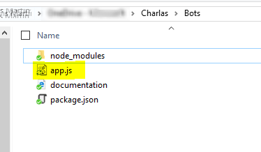
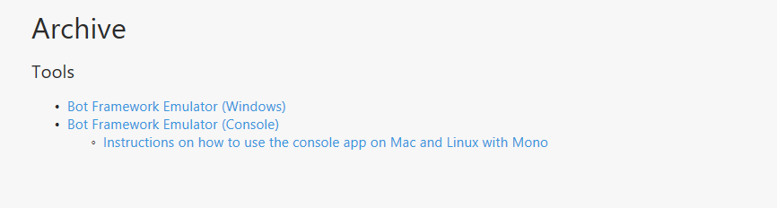
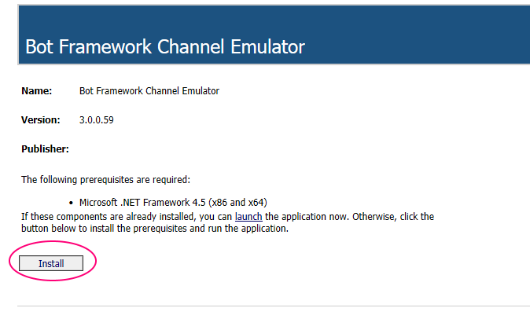
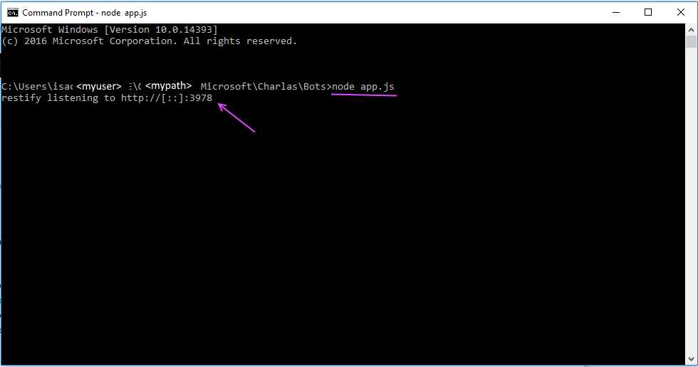
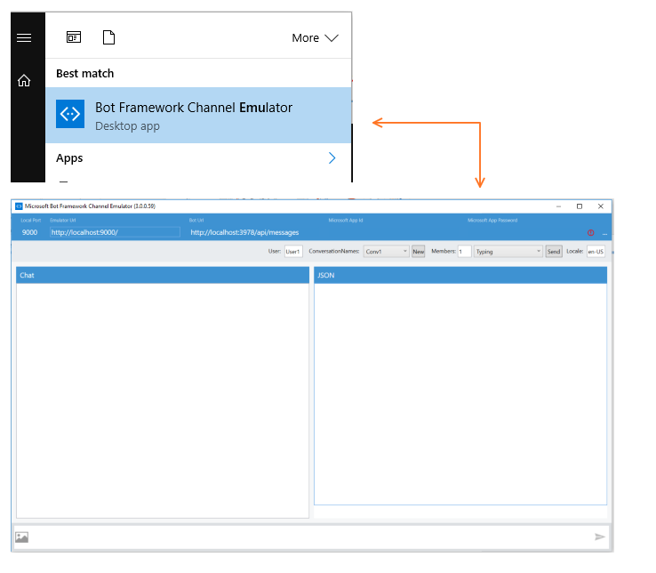
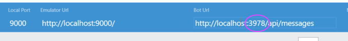
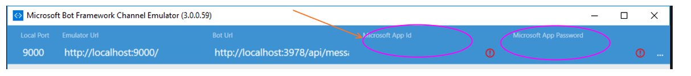
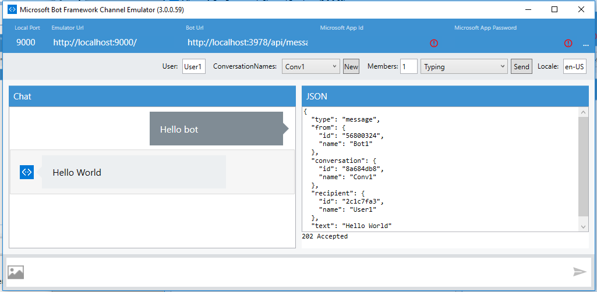
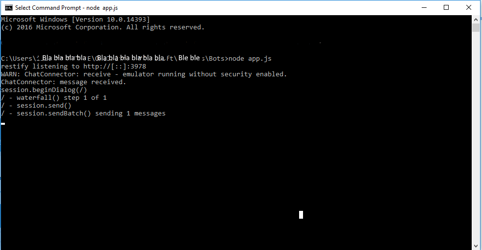

# Bot NodeJS - Hello World 

Mi *getting started* empieza [aquí](https://docs.botframework.com/en-us/node/builder/overview/)

He creado una carpeta para poner el código de mi bot en mi caso el PATH =  C:\Users\<myuser>\OneDrive\Charlas\Bots

Todo empieza abriendo una consola, navegando a este path y con **npm init**

Y después:

**npm install --save botbuilder**

**npm install --save restify**

Entonces creo un archivo en mi path (donde ya he descargado [botbuilder](https://www.npmjs.com/package/botbuilder) y [restify](http://restify.com/)) y lo nombro *app.js*. Será el fichero principal de primer bot.



Haz el bot "Hola mundo" con estas líneas de código dentro del fichero *app.js*:

[También puedes descargarte directamente el fichero...](app.js) 

```javascript
var restify = require('restify');
var builder = require('botbuilder');

// Setup Restify Server
var server = restify.createServer();
server.listen(process.env.port || process.env.PORT || 3978, function () {
    console.log('%s listening to %s', server.name, server.url);
});

// Create chat bot
var connector = new builder.ChatConnector({
    appId: process.env.MICROSOFT_APP_ID,
    appPassword: process.env.MICROSOFT_APP_PASSWORD
});
var bot = new builder.UniversalBot(connector);
server.post('/api/messages', connector.listen());

bot.dialog('/', function (session) {
    session.send("Hello World");
});
```

Y ahora pruébalo.

Para ello descarga el [Bot Framework Emulator](https://docs.botframework.com/en-us/downloads). En el apartado **Tools** -->   *Bot Framework Emulator (Windows)*.



E instálalo:



Ejecuta el bot  con **node app.js**
El módulo restify comienza a escuchar el puerto **3978** por defecto:



Una vez que esté ejecutándose el bot (en local), abre el emulador para probarlo:



Por defecto este puerto será el que está escuchando el restify en el paso anterior, si no es así, recuerda cambiarlo.



Cuando se ejecuta en local no hay que poner nada aquí (aunque salgan esos iconillos "despintantes")



Ya puedes hablarle a tu bot. De momento la conversación no es demasiado interesante… pero ya mejoraremos:



Observa como en la consola se va trazando log:



Fin de la primera parte.
Puedes seguir en [PublicaTuBot](PublicaTuBot.md)